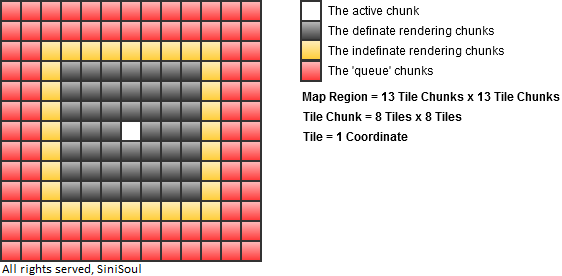
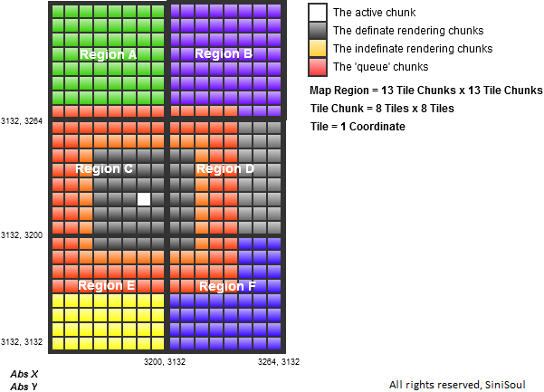

# Map region system

A coordinate system is used to navigate through the RuneScape
world.
That coordinate system is based upon three variables, the absolute
X-, Y-, and Z-coordinates.

## Definitions

A **tile** is the in-game representation of an absolute coordinate.

e.g. The coordinates `(3222, 3222)` represents one tile in the heart
of the Lumbridge castle.

A **chunk of tiles**, 8 x 8 in size.
Also known as a region before the scope of a region was understood.
The chunk is considered a point so it has X and Y coordinates.
There are two forms of a Chunk: formatted and non-formatted,
a formatted chunks equation is:

```java
int chunkX = (getAbsoluteX() >> 3) - 6;
int chunkY = (getAbsoluteY() >> 3) - 6;
```

This centers the chunk on the map, more on that later.

The normal chunk equation is:

```java
int chunkX = (getAbsoluteX() >> 3);
int chunkY = (getAbsoluteY() >> 3);
```

e.g. For the coordinates `(3211, 3424)`, chunk X (formatted) is 395 and
the chunk Y (un-formatted) is 428.''

## Region

A **region** is 64 x 64 in size, or 8 x 8 in chunks.
The region is considered a point so it has X and Y coordinates.

The equation for finding the region the coordinates is within is:

```java
int regionX = (getUnformattedRegionX() >> 3); // getUnformatedRegionX() / 8;
int regionY = (getUnformattedRegionY() >> 3); // getUnformatedRegionY() / 8;
```

e.g. For the coordinates `(3211, 3424)`, region X is 50, and the
region Y is 53.

Note: The Region X and Region Y coordinates are traditionally not used
in server location calculations; but practical region systems should use
this calculation for many purposes.

## Map

There is no calculation for a map, and there is no Map X or Map Y.

A Map is, however, a 104 x 104 area made up of 13 x 13 chunks.
Why is the number not even you may ask?
Because it has a center.
The `(7, 7)` map chunk of the map is the center, and is also the formatted
chunk.

When a region update is called by the server, a new map is called, but you
must understand that the formatted chunk never changes; the tiles in the
map, however, are updated and trimmed.
When the player moves out of the formatted chunk, the map is re-positioned
to make that chunk the center yet again.  
As stated, a new update is not needed every time the player enters a
new region, but when the range of +- 32 from the point in the center of
the chunk is reached, an update is required to update the map to the
new objects so that the 'black space' or fog is not reached. Confused?

## Diagram



The active chunk is the chunk in which the player resides.
The definite rendering chunks are the chunks in which will be rendered
on the players screen no matter where they are in the active chunk.
The indefinite rendering chunks are the chunks in which depending on
where the player is within the active chunk they may be rendered or not.
Remember this depends on the +- distance of 32 from the players
absolute position. The queue chunks are pre-loaded chunks in whichafter the
active chunk is moved may be disposed of or activated depending upon the
direction in which the active chunk changes.

## Loading

The following were the regions loaded for the coordinates `(3183, 3217)`:



If you can imagine a puzzle, a 64 x 64 piece does not fit equally within
the 104 x 104 area.
So, bits of each region are taken that are within the 104 x 104 map area.

The amount of regions that are to be loaded can be calculated this way:

Please note that Region X and Region Y are not formatted.

```java
int amt = 0;

for (int i21 = (player.getLocation().getRegionX() - 6) / 8; i21 <= (player.getLocation().getRegionX() + 6) / 8; i21++) {
    for (int k23 = (player.getLocation().getRegionY() - 6) / 8; k23 <= (player.getLocation().getRegionY() + 6) / 8; k23++)
        amt++;
}
```

Along with this, the base X and base Y of each of the region can be
calculated:

```java
for (int i21 = (player.getLocation().getRegionX() - 6) / 8; i21 <= (player.getLocation().getRegionX() + 6) / 8; i21++) {
    for (int k23 = (player.getLocation().getRegionY() - 6) / 8; k23 <= (player.getLocation().getRegionY() + 6) / 8; k23++)
        System.out.println(i21 + " X " + (i21 << 6) + "," + k23 + " Y " + (k23 << 6));;;
}
 ```

The 'X' and 'Y' coordinates represents the coordinates of the region as
depicted in the diagram. After the regions are loaded they are trimmed
to the tiles that are necessary.

## Example Location class

The following is an example Location class written by sinisoul.
It is not heavily commented due to it being a very simple class,
and it should be easy to follow if you read this section in full.

```java
package net.forge.content.world.node;

/**
 * RuneForge (317)
 * @version 1.0.0
 * @author SiniSoul (SiniSoul@live.com)
 */
public final class Location {

    /**
     * The Tile X and Y coordinates.
     */
    private int tilex = 0,
                tiley = 0;

    /**
     * The Height of the location.
     */
    private int height = 0;

    /**
     * The asynchronous Chunk X and Y coordinates; used in region updating. 
     */
    private int chunkx = 0,
                chunky = 0;

    public void setTileX(int tilex) {
        this.tilex = (tilex & 0xFFFF);
    }

    public int getTileX() {
        return tilex;
    }

    public void setTileY(int tiley) {
        this.tiley = (tiley & 0xFFFF);
    }

    public int getTileY() {
        return tiley;
    }

    /**
     * @param formatted If the chunk is formatted for map positioning or
     *                 other formatted chunk comparison.    
     */
    public int calculateChunkX(boolean formatted) {
        return formatted ? (getTileX() >> 3) - 6 : (getTileX() >> 3);
    }

    /**
     * @param formatted If the chunk is formatted for map positioning or
     *                 other formatted chunk comparison.                
     */
    public int calculateChunkY(boolean formatted) {
        return formatted ? (getTileY() >> 3) - 6 : (getTileY() >> 3);
    }

    public void updateChunkX() {
        this.chunkx = calculateChunkX(true);
    }

    public void updateChunkY() {
        this.chunkx = calculateChunkY(true);
    }

    public int getChunkX() {
        return chunkx;
    }

    public int getMapLocalX() {
        return getTileX() - (getChunkX() << 3);
    }

    public int getChunkY() {
        return chunky;
    }

    public int getMapLocalY() {
        return getTileX() - (getChunkY() << 3);
    }

    public void setHeight(int height) {
        this.height = (height & 0x3);
    }

    public int getHeight() {
        return height;
    }

    public int getRegionX() {
        return calculateChunkX(false) >> 3;
    }

    public int getRegionLocalX() {
        return getTileX() - (getRegionX() << 6);
    }

    public int getRegionY() {
        return calculateChunkY(false) >> 3;
    }

    public int getRegionLocalY() {
        return getTileY() - (getRegionY() << 6);
    }

    public void set(int tilex, int tiley, int height) {
        setTileX(tilex);
        setTileY(tiley);
        setHeight(height);
    }

    public Location(int tilex, int tiley, int height) {
        set(tilex, tiley, height);
        updateChunkX();
        updateChunkY();
    }
}
```
